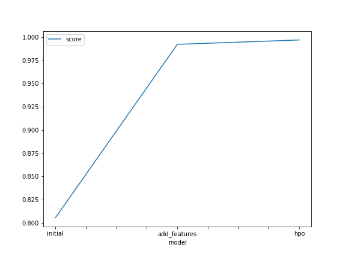
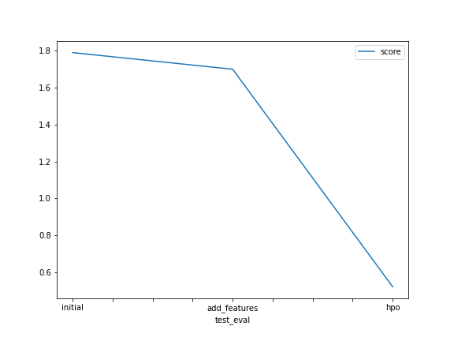

# Report: Predict Bike Sharing Demand with AutoGluon Solution
#### Mohamad Ashraf Ahmed Salama

## Initial Training
### What did you realize when you tried to submit your predictions? What changes were needed to the output of the predictor to submit your results?
There were some negative values, removing them.

### What was the top-ranked model that performed?

LightGBMLarge_BAG_L2 was the best one after doing hpo and EDA

## Exploratory data analysis and feature creation
### What did the exploratory analysis find and how did you add additional features?

that there are some features with limited values so it's better to make it categorical
by making the DateTime into 4 different columns and making the season and weather categorical

### How much better did your model perform after adding additional features and why do you think that is?

wasn't that much was about 10% increas

## Hyperparameter tuning
### How much better did your model perform after trying different hyperparameters?
about 280% better 

### If you were given more time with this dataset, where do you think you would spend more time?
in EDA

### Create a table with the models you ran, the hyperparameters modified, and the Kaggle score.
|model|hpo1|hpo2|hpo3|score|
|--|--|--|--|--|
|initial|default|default|default|1.70000|
|add_features|default|default|default|1.69317|
|hpo|120|True|True|0.57576|

### Create a line plot showing the top model score for the three (or more) training runs during the project.

### Create a line plot showing the top Kaggle score for the three (or more) prediction submissions during the project.

## Summary

the project was really helpfull for me to grasp the overall process of making ml model and improving it bytunning and EDA 